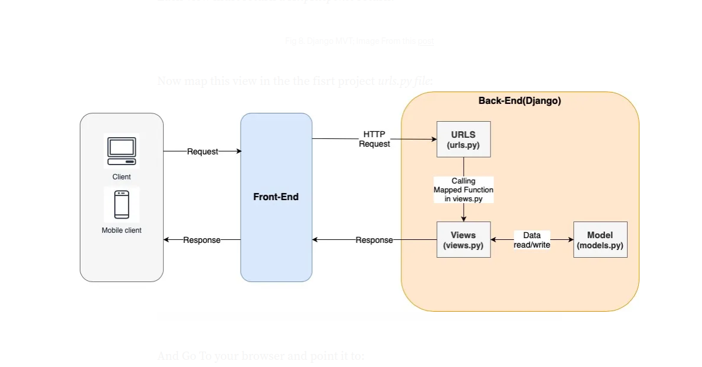
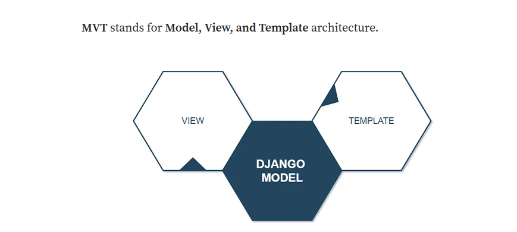
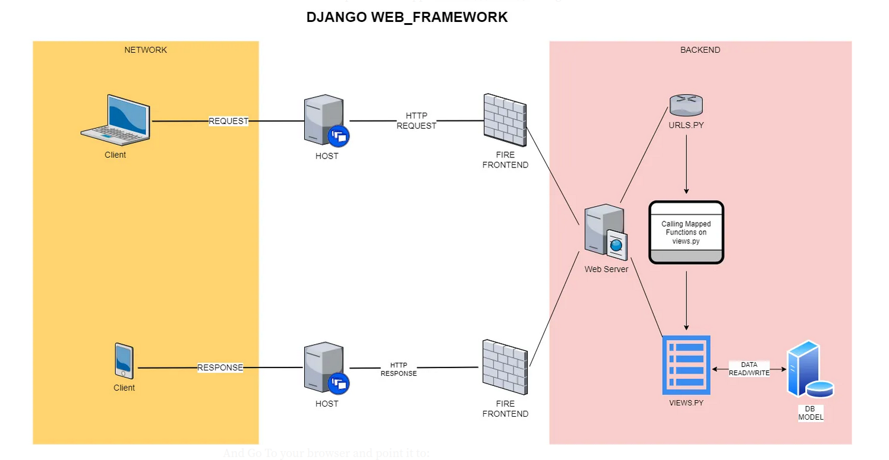

## added model field
```python
from django.utils import timezone
...
    date_posted = models.DateTimeField(default=timezone.now)
...

```
# dajngo tags
```html
<!DOCTYPE html>
<html>
    <head>
        
            <title>Django Blog - {{ title }}</title>
        
            <title>Django Blog</title>
                
    </head>
    <body> 
        
           <h1>{{ post.title }}</h1>
            <p>{{ post.author }} on {{ post.date_posted|date:"F d, Y" }}</p>
            <p>{{ post.content }}</p>
                
    </body>
</html>
```


## - put the base.html | bootstrap and tailwind
```html
    <!-- Bootstrap & Tailwind CSS -->
    <link href="https://cdn.jsdelivr.net/npm/bootstrap@5.1.3/dist/css/bootstrap.min.css" rel="stylesheet" integrity="sha384-1BmE4kWBq78iYhFldvKuhfTAU6auU8tT94WrHftjDbrCEXSU1oBoqyl2QvZ6jIW3" crossorigin="anonymous">
    <script src="https://cdn.tailwindcss.com"></script>
    <link href="https://cdn.jsdelivr.net/npm/bootstrap@5.0.2/dist/css/bootstrap.min.css" rel="stylesheet" integrity="sha384-EVSTQN3/azprG1Anm3QDgpJLIm9Nao0Yz1ztcQTwFspd3yD65VohhpuuCOmLASjC" crossorigin="anonymous">
....

  <body>
        <div class="container">
            
            
        </div>
    <!-- Option 1: Bootstrap Bundle with Popper -->
    <script src="https://cdn.jsdelivr.net/npm/bootstrap@5.1.3/dist/js/bootstrap.bundle.min.js" integrity="sha384-ka7Sk0Gln4gmtz2MlQnikT1wXgYsOg+OMhuP+IlRH9sENBO0LRn5q+8nbTov4+1p" crossorigin="anonymous"></script>
    </body>

....
```


## create navbar
```html
<nav class="navbar navbar-expand-lg navbar-light bg-light">
  <div class="container-fluid">
	<a class="navbar-brand" href="#">JungleDev</a>
	<button class="navbar-toggler" type="button" data-bs-toggle="collapse" data-bs-target="#navbarSupportedContent" aria-controls="navbarSupportedContent" aria-expanded="false" aria-label="Toggle navigation">
	  <span class="navbar-toggler-icon"></span>
	</button>
	<div class="collapse navbar-collapse" id="navbarSupportedContent">
	  <ul class="navbar-nav me-auto mb-2 mb-lg-0">
		<li class="nav-item">
		  <a class="nav-link active" aria-current="page" href="#">Home</a>
		</li>
		<li class="nav-item">
		  <a class="nav-link" href="#">About</a>
		</li>
		<li class="nav-item">
		  <a class="nav-link disabled">Disabled</a>
		</li>
		<li class="nav-item">
		  <a class="nav-link disabled">Login</a>
		</li>		
		<li class="nav-item">
		  <a class="nav-link disabled">Register</a>
		</li>
	  </ul>
	  <form class="d-flex">
		<input class="form-control me-2" type="search" placeholder="Search" aria-label="Search">
		<button class="btn btn-light" type="submit">Search</button>
	  </form>
	</div>
  </div>
</nav>


 <div role="main" class="container">
            <div class="col-md-8">
                    
                    
            </div>
            <div class="col-md-1">
                <div class="content-section absolute top-14 right-3 h-180 w-160">
                <h3>Our Sidebar</h3>
                    <p class='text-muted'>You can put any information here you'd like.
                    <ul class="list-group">
                        <li class="list-group-item list-group-item-light">Latest Posts</li>
                        <li class="list-group-item list-group-item-light">Announcements</li>
                        <li class="list-group-item list-group-item-light">Calendars</li>
                        <li class="list-group-item list-group-item-light">etc</li>
                    </ul>
                    </p>
            
        </div>
    <!-- Option 1: Bootstrap Bundle with Popper -->
    <script src="https://cdn.jsdelivr.net/npm/bootstrap@5.1.3/dist/js/bootstrap.bundle.min.js" integrity="sha384-ka7Sk0Gln4gmtz2MlQnikT1wXgYsOg+OMhuP+IlRH9sENBO0LRn5q+8nbTov4+1p" crossorigin="anonymous"></script>

```


# all_news.html {forni ichida bo'ladi}
```html


    
    <div class="container">
    <article class="media content-section box-content h-50 w-50 p-5 border-1">       
      
        <div class="media-body">
          <div class="article-metadata">
            <a class="font-weight-bold mr-2" href="#">{{ post.author }}</a>				  
            <small class="text-muted">{{ post.date_posted}}</small> 				
          </div>				
          <h1 class="display-6" href="#"><strong><a>{{ post.title }}</a></strong></h1>
          <br>
          <p>{{ post.content }}
        </div>
    </article>
    </div>
     
  
```


#
#
#
#
#
#
# FORMS


## Step — Create a view inside users_hub/views.py file, type:
```python
from django.shortcuts import render
from django.contrib.auth.forms import UserCreationForm
def register(request):
    form = UserCreationForm()
    return render(request, 'users_hub/register.html', {'form': form})
    
```

## 04. Step — Create this folder structure:
```python
users_hub/templates/users_hub/
register.html
```

## Step — Type inside register.html
```python


    <div class="content-section">
        <form method="POST">
            
            <fieldset class="form-group">
                <legend class="border-botton mb-4">Join Today!</legend>
                {{ form }}
            </fieldset>
            <div class="form-group">
                <button class="btn btn-outline-info" type="submit">Sign Up!</button>
            </div>
        </form>
        <div class="border-top pt-3">
            <small class="text-muted">
                Already Have an Account? <a class="ml-2" href="#">Sign In</a>
            </small>
        </div>
    </div>
    
```

## Step — GoTo django_project/urls.py and add:
```python
from django.contrib import admin
from django.urls import path, include
from users_hub import views as user_viewsurlpatterns = [
path('admin/', admin.site.urls),
path('register/', user_views.register, name='register'),
path('', include('blog.urls')),
             ]
```

## Step — Run the server ```python manage.py runserver```
```
go to ->  http://127.0.0.1:8000/register/
```

## Step — Let’s boost our users_hub/views.py file, type:
```python
from django.shortcuts import render, redirect
from django.contrib.auth.forms import UserCreationForm
from django.contrib import messages


def register(request):
    if request.method == 'POST':
        form = UserCreationForm(request.POST)
        if form.is_valid():
            form.save()
            username = form.cleaned_data.get('username')
            messages.success(request, f'Account created for {username}!')
            return redirect('blog-home')
    else:
        form = UserCreationForm()
    return render(request, 'users_hub/register.html', {'form': form})
```

## Step — Update template at blog/templates/blog/base.html file, and inject this snippet code exactly into the div that renders each feature sent by the child templates (right above block content):
```html 
<div role="main" class="container">
    <div class="row">
        <div class="col-md-8">
          
             
             <div class="alert alert-{{ message.tags }}">
               {{ message }}
             </div>
             
          
          
          
        </div>
    </div>
```


######################################################################################################
######################################################################################################
######################################################################################################
######################################################################################################


## Step — Installing [Django Crispy Forms](https://django-crispy-forms.readthedocs.io/en/latest/install.html#installing-django-crispy-forms):
```sh 
pip install django-crispy-forms
```
```python
# settings.py

INSTALLED_APPS = (
    ...
    'crispy_forms',
)


# Crisp config
CRISPY_TEMPLATE_PACK = 'bootstrap4'
```
### Apply crispy filter at users_hub/templates/users_hub/register.html

```html

...<form method="post" class="...">
   <fieldset>
      <legend class="">...</legend>
         {{ form|crispy }}
   <fieldset>
</form>
```


# Step — Create a new file [forms.py]() inside your [users_hub]() app, type:
```python
from django import forms
from django.contrib.auth.models import User
from django.contrib.auth.forms import UserCreationFormclass UserRegisterForm(UserCreationForm):
   email = forms.EmailField()
   
   class Meta:
      model = User
      fields = ['username', 'email', 'password1', 'password2']
```


## Step — Modify users_hub/views.py to:

```python
from django.shortcuts import render, redirect
# from django.contrib.auth.forms import UserCreationForm
from django.contrib import messages
from users_hub.forms import UserRegisterForm


def register(request):
    if request.method == 'POST':
        form = UserRegisterForm(request.POST)
        if form.is_valid():
            form.save()
            username = form.cleaned_data.get('username')
            messages.success(request, f'Account created for {username}!')
            return redirect('blog-home')
    else:
        form = UserRegisterForm()
    return render(request, 'users_hub/register.html', {'form': form})
```


#
#
#
#
#
#
#
# Authentications, Login & Logout
#
### Step — GoTo django_project/urls.py and add:
```python
from django.contrib import admin
from django.contrib.auth import views as auth_views # new
from django.urls import path, include
from users_hub import views as user_viewsurlpatterns = [
    path('admin/', admin.site.urls),
    path('register/', user_views.register, name='register'),
    path('login/', auth_views.LoginView.as_view(template_name="users_hub/login.html"), name='login'), #new
    path('logout/', auth_views.LogoutView.as_view(template_name="users_hub/logout.html"), name='logout'), #new
    path('', include('blog.urls')),
]
```


### Step —Create a login.html template inside:
```
users_hub/templates/users_hub/login.html
```

```html



    <div class="content-section">
        <form method="POST">
            
            <fieldset class="form-group">
                <legend class="border-botton mb-4">Log In</legend>
                {{ form|crispy }}
            </fieldset>
            <div class="form-group">
                <button class="btn btn-outline-info" type="submit">Login</button>
            </div>
        </form>
        <div class="border-top pt-3">
            <small class="text-muted">
                Need an Account? <a class="ml-2" href="">Sign Up Now</a>
            </small>
        </div>
    </div>

```
#
```
users_hub/templates/users_hub/logout.html
```

```html


<div class="container">
    <h3>Logged out!</h3>
    <h2>Thanks for spending some quality time with the web site today.</h2>
    <div class="border-top pt-3">
        <small class="text-muted">
            <a href="">Log In Again</a>
        </small>
    </div>
</div>

```

#
```
users_hub/templates/users_hub/profile.html
```
```html


<div class="container border-top pt-3">
    <h1>{{ user.username }}</h1>
</div>    

```

#
#
## Step — GoTo django_project/Settings.py and at the very end, add:
```python
....# Crisp configCRISPY_TEMPLATE_PACK = 'bootstrap4'# Redirecting to home
LOGIN_REDIRECT_URL = 'blog-home'
ACCOUNT_LOGOUT_REDIRECT_URL = 'blog-home'
LOGIN_URL = 'login'
```


## Step — Modify users_hub/views.py to:
```python
from django.shortcuts import render, redirect
from django.contrib import messages
from users_hub.forms import UserRegisterForm
from django.contrib.auth.decorators import login_requireddef register(request):
   if request.method == 'POST':
      form = UserRegisterForm(request.POST)
      if form.is_valid():
      form.save()
      username = form.cleaned_data.get('username')
      messages.success(request, f'Hi {username}! Your account has been created! Now login!')
      return redirect('login')else:
   form = UserRegisterForm()
   return render(request, 'users_hub/register.html', {'form': form})@login_required
def profile(request):
   return render(request, 'users_hub/profile.html')
```

#
## change base.html
```python

   <li class="nav-item">
      <a class="nav-link" href="">Logout</a>
   </li>
   <li class="nav-item">
      <a class="nav-link" href="">Profile</a>
   </li>

   <li class="nav-item">
      <a class="nav-link" href="">Login</a>
   </li>
   <li class="nav-item">
      <a class="nav-link" href="">Register</a>
   </li>


   <li class="nav-item">
      <a class="nav-link" href="">Hi,{{ user }}!</a>
   </li>

```


#
## Step — Create a users_hub/register.html
```html



    <div class="content-section">
        <form method="POST">
            
            <fieldset class="form-group">
                <legend class="border-botton mb-4">Join Today!</legend>
                {{ form|crispy }}
            </fieldset>
            <div class="form-group">
                <button class="btn btn-outline-info" type="submit">Sign Up!</button>
            </div>
        </form>
        <div class="border-top pt-3">
            <small class="text-muted">
                Already Have an Account? <a class="ml-2" href="">Sign In</a>
            </small>
        </div>
    </div>

```


## base.html
```html

<!DOCTYPE html>
<html>
    <head>
    <!-- Required meta tags -->
    <meta charset="utf-8">
    <meta name="viewport" content="width=device-width, initial-scale=1">
        <!-- Bootstrap CSS -->
    <link href="https://cdn.jsdelivr.net/npm/bootstrap@5.1.3/dist/css/bootstrap.min.css" rel="stylesheet" integrity="sha384-1BmE4kWBq78iYhFldvKuhfTAU6auU8tT94WrHftjDbrCEXSU1oBoqyl2QvZ6jIW3" crossorigin="anonymous">
	  <script src="https://cdn.tailwindcss.com"></script>
	  <link href="https://cdn.jsdelivr.net/npm/bootstrap@5.0.2/dist/css/bootstrap.min.css" rel="stylesheet" integrity="sha384-EVSTQN3/azprG1Anm3QDgpJLIm9Nao0Yz1ztcQTwFspd3yD65VohhpuuCOmLASjC" crossorigin="anonymous">
    <!-- <link rel="stylesheet" type="text/css" href=""> -->
        
            <title>Django Blog - {{ title }}</title>
        
            <title>Django Blog</title>
        
    </head>
    <body>
        <nav class="navbar navbar-expand-lg navbar-light bg-light">
            <div class="container-fluid">
              <a class="navbar-brand" href="">JungleDev</a>
              <button class="navbar-toggler" type="button" data-bs-toggle="collapse" data-bs-target="#navbarSupportedContent" aria-controls="navbarSupportedContent" aria-expanded="false" aria-label="Toggle navigation">
                <span class="navbar-toggler-icon"></span>
              </button>
              <div class="collapse navbar-collapse" id="navbarSupportedContent">
                <ul class="navbar-nav me-auto mb-2 mb-lg-0">
                  <li class="nav-item">
                    <a class="nav-link active" aria-current="page" href="">Home</a>
                  </li>
                  <li class="nav-item">
                    <a class="nav-link" href="">About</a>
                  </li>
                  
                  <li class="nav-item">
                    <a class="nav-link" href="">Logout</a>
                  </li>
                  <li class="nav-item">
                    <a class="nav-link" href="">Profile</a>
                  </li>
                  
                  <li class="nav-item">
                    <a class="nav-link" href="">Login</a>
                  </li>		
                  <li class="nav-item">
                    <a class="nav-link" href="">Register</a>
                  </li>
                  
                  
                  <li class="nav-item">
                    <a class="nav-link" href="">Hi, {{ user }}!</a>
                  </li>
                  
                </ul>
                <form class="d-flex">
                  <input class="form-control me-2" type="search" placeholder="Search" aria-label="Search">
                  <button class="btn btn-light" type="submit">Search</button>
                </form>
              </div>
            </div>
          </nav>
        <div role="main" class="container">
            <div class="row">
                <div class="col-md-8">
                  
                     
                     <div class="alert alert-{{ message.tags }}">
                       {{ message }}
                     </div>
                     
                  
                  
                  
                </div>
            </div>
            <div class="col-md-4">
                <div class="content-section absolute top-14 right-3 h-180 w-160">
                <h3>Our Sidebar</h3>
                    <p class='text-muted'>You can put any information here you'd like.
                    <ul class="list-group">
                        <li class="list-group-item list-group-item-light">Latest Posts</li>
                        <li class="list-group-item list-group-item-light">Announcements</li>
                        <li class="list-group-item list-group-item-light">Calendars</li>
                        <li class="list-group-item list-group-item-light">etc</li>
                    </ul>
                    </p>
                </div>
            </div>
        </div>
     <!-- Option 1: Bootstrap Bundle with Popper -->
     <script src="https://cdn.jsdelivr.net/npm/bootstrap@5.1.3/dist/js/bootstrap.bundle.min.js" integrity="sha384-ka7Sk0Gln4gmtz2MlQnikT1wXgYsOg+OMhuP+IlRH9sENBO0LRn5q+8nbTov4+1p" crossorigin="anonymous"></script>
    </body>
</html>
```